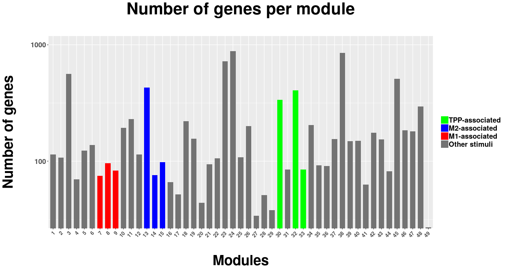

# Defining Macrophage Gene Signatures

  Macrophages have been demonstrated to develop highly complex activation profiles in a diverse set of microenvironments [@Ginhoux2016]. Although many genetic markers are known to play important roles within the macrophage biology context, defining a robust set of gene signatures for the currently known phenotypic subsets remains a challenging task [@Martinez2014]. Recent cytometric and genomic approaches have revealed major limitations regarding the classic M1 versus M2-polarization model, which is no longer accepted as suitable to explain the biologic dynamics of macrophage response [@Martinez2014].
  
  In the pursuit of standardization towards reproducible research, back in 2014 a group of specialists launched nomenclatures and experimental guidelines for the macrophage activation profiles well-established by then [@Murray2014]. However, much of the recent genomic data has challenged the phenotypic techniques used to classify macrophage subsets and therefore novel approaches emerged as alternatives. In the same year that Murray's and colleagues' paper was published, a multi-center work demonstrated the actual heterogeneity of macrophages through machine learning algorithms applied to single-cell transcriptome analysis [@Xue2014]. 
  
  Assessing the transcriptomes from almost 300 diversely _in-vitro_ stimulated human macrophages, Xue and colleagues used weighted gene coexpression network analysis (WGCNA) to identify 49 coexpression modules, which ranged from less than 30 to over 800 different genes of size [@Xue2014]. Based on Pearson correlation, WGCNA defines gene sets, known as _transcriptional modules_, which present with specific coexpression patterns across each treatment condition [@Langfelder2008]. These modules could then be used to visualize the comprehensiveness of the M1 versus M2 model. As noted by the authors, stimuli not M1- or M2-associated showed prominent patterns consistent with a rather dynamic spectrum model of cell activation.
  
  In order to achieve high sensivity for potential macrophage phenotypes, in this study the 49 transcriptional modules produced by Xue and colleagues were used as gene sets for further analysis. The Figure 1 shows the distribution of number of genes across the different modules.
  

