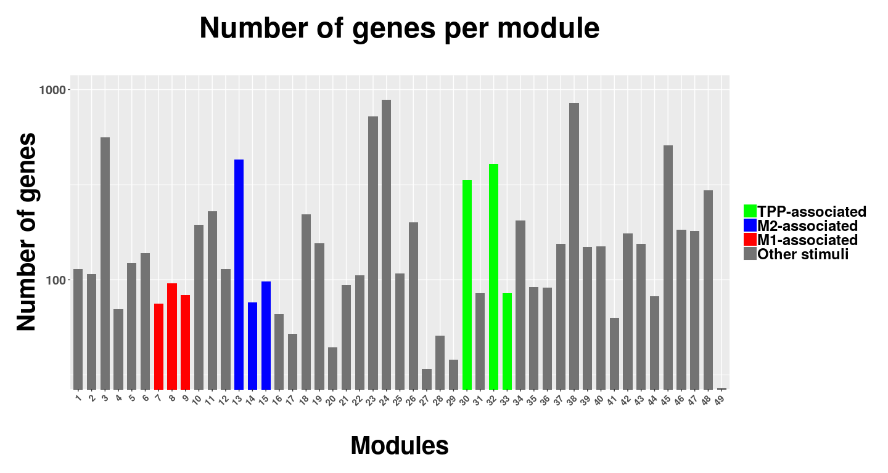
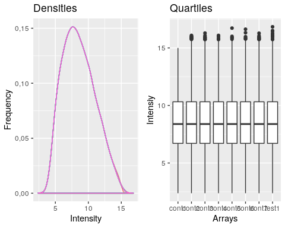

# Defining Macrophage Gene Signatures

## Macrophage Genomic Integrative Analysis

  Genomic integrative analysis is a computationally-expensive and rather complex task. First, one must integrate different technologies (_e.g._ microarray and RNA sequencing) from several distinct platforms (_e.g._ Affymetrix, Illumina, Agilent) [@Walsh2015]. Second, although greater number of samples yields higher statistical power, potential confounding factors must be taken into account. When it comes to lung injury, a wide range of animal models and human conditions have already been tested, and their respective datasets should be treated with care. For instance, the widely used bleomycin-induced IPF model shows enrichment of traditionally M1-associated genes at very early stages [@Bauer2015]. Fungal infection models, on the other hand, show divergent genomic markers with potentially protective roles associated with genes from the M2 spectrum [@Bhatia2011; @Margalit2015]. Both cases, though, may lead to pulmonary fibrosis through macrophage activity [@Iwasaki2016; @Gieseck2017; @Wynn2016]. Other challenges include the adequacy of sample sizes, pre-processing techniques, statistical analysis, modeling validation, experimental design as well as the lack of a comprehensive framework for the execution of genomic meta-analyses [@Ramasamy2008]. Of note, the term "meta-analysis" refers to cases when the researcher analyzes each dataset separately and draws conclusions based on the combination of final statistical results, whereas "cross-platform normalization" is used to describe the integration of raw data ("merging") from multiple sources for combined downstream analysis [@Walsh2015]. Here, we use "integrative analysis" to denote both terms interchangeably as not all datasets analyzed are suitable for merging.
  
  The applicability of integrative analysis for elucidating reproducible macrophage dynamics and even predicting clinical outcome based on the enrichment of their gene signatures has been previously tested [@Becker2015a]. Using data from human-derived macrophages challenged with two sets of _in-vitro_ activation stimuli, namely "classical" (IFN-g + LPS; TNF-a) and "alternative" (IL-4; IL-13), the authors were able to establish prognostic values in diverse clinical settings such as viral infections and asthma. Noteworthy, however, is the fact that gene signatures were still relatively limited by the M1 versus M2 paradigm, which hinders interpretation at the cellular and molecular levels. After all, how to understand the heterogeneity within such microenvironments and, furthermore, how to address similar macrophage subsets that are constantly overlooked (or that are yet to be described)? How comprehensive should an integrated analysis be to assure robustness of detected gene expression patterns? The answers to these questions may eventually lead to better pharmacology development and health care regarding many life-threatening, macrophage-related diseases.
  
  Recently, an elegant work integrated several datasets from human biopsies as well as data from wide range of mouse strains within the context of LPS exposure [@Buscher2017]. Surprising was not the high level of gene expression variability across strains, but the ability to nevertheless infer the degree of polarization of macrophages in transcriptome samples. To do so, the authors looked at the expression levels of IL-12b and arginase-1, known as M1- and M2-markers, respectively. After correction by population expression mean, the quotient between the two molecules' RMA (robust multi-array average: quantile normalized, background-corrected, log2 transformed intensities) represented what was named Polarization Factor Ratio (PFR). Next, the authors identified gene sets that were highly correlated with the PFR measurements. Those gene sets could then be used to describe the activation state of tumor-associated macrophages in cancer biopsy samples and even predict patient survival.
  
  Buscher's paper (2017) is an example of successful integrative analysis applied to the molecular study of macrophage biology. When it comes to IPF, their findings are further supported by protein-level assessment approaches as the behavior of immune cells in such conditions has been extensively studied [@Misharin2013a; @Yu2016; Mittar2011; @Landi2014]. Venosa and colleagues (2016) characterized the macrophage subpopulations in BAL fluid from Wistar rats exposed to nitrogen mustard (NM) – Figure 1 [@Venosa2016]. In their study, infiltrating M1-like macrophages rapidly increased until three days after the treatment, which correlated with the upregulation of proinflammatory M1 genes and tissue injury. The infiltrating M1 cells started being replaced after the third day, and an accumulation of M2-like macrophages was seen by the 7th day after NM exposure. A persistent increase of M2-like cells was observed until the 28th day after NM, and that response was correlated with M2 genes upregulation and fibrosis development. Figure 1 shows the time-course profile of such cells.
  
![Figure 1 - Macrophage dynamics in IPF model. Adapted from: [@Venosa2016].](Development_files/figure-docx/venosa-2.png)
  
  Many other studies confirm Venosa's data [@Wynn2016; @Gieseck2017; @Nie2017; @Luzina2015; @Peng2013; @Bauer2015; @Hams2015; @Braga2015; @Malaviya2016; @Kolahian2016; @Williamson2014; @Lee2018]. However, one may note the repetitive assumptions over the M1 versus M2 paradigm for most of the past works. High-throughput technologies combined with single-cell techniques are constantly being applied to yield more precise and informative data. Such a promising methodology has already revealed molecular heterogeneity much greater than previously predicted - for both innate and adaptive immune responses [@Lu2015; @Chevrier2017; @Neu2017]. As an example, mature T helper 17 (Th17) cells have been demonstrated to develop a wide range of transcription programs, which opposed previous conceptions of high gene expression similarity among antigen-specific T cells [@Han2014]. The ability to understand the development of these transcription diversities within populations once thought as homogeneous is one of the current challenges in biology and health research. Furthermore, we are still to meet comprehensive and reproducible proteomic characterization of macrophage subpopulations, although relevant advances have been made [@Court2017; @Tarasova2016; @Chevrier2017; @Becker2012]. Multi-omic integrative characterizations will therefore build a stronger and more robust body of knowledge to drive macrophage-based therapy and diagnostics [@Bakker2018].
  
  Here, we seek to determine a vast set of protein-coding genomic signatures that allows the investigation of possibly unacknowledged macrophage activation patterns across multiple datasets of pulmonary fibrosis models and IPF patients. In order to do so, we take advantage of single-cell sequencing data from human macrophages that were artificially stimulated with common and uncommon sets of signaling molecules so that we reach greater depth in our cross-platform characterization of macrophage dynamics [@Xue2014].

## Macrophage Gene Signatures

  Macrophages have been demonstrated to develop highly complex activation profiles in a diverse set of microenvironments [@Ginhoux2016]. As previously discussed, these cells are key players in conditions as idiopathic pulmonary fibrosis (IPF) [@Bauer2015; @Wynn2011; @Venosa2016]. Although many genetic markers are known to play important roles within the macrophage biology context, defining a robust set of gene signatures for the currently known phenotypic subsets remains a challenging task [@Martinez2014]. Recent cytometric and genomic approaches have revealed major limitations regarding the classic M1- versus M2-polarization model, which is no longer suitable to explain the biological dynamics of macrophage response [@Martinez2014].
  
  In the pursuit of standardization towards reproducible research, back in 2014 a group of specialists suggested nomenclatures and experimental guidelines for the macrophage activation profiles well-established by then [@Murray2014]. However, the recent abundance of genomic data has challenged the classical protein-level techniques used to sort macrophage subsets and therefore novel classifications emerged. In the same year that Murray's paper was published, a multi-center work attributed a much higher heterogeneity to macrophages through machine learning algorithms applied to single-cell transcriptome analysis [@Xue2014]. 
  
  Assessing the transcriptomes from almost 300 _in-vitro_ stimulated human macrophages, Xue and colleagues used weighted gene co-expression network analysis (WGCNA) to identify 49 co-expression modules, each of which ranging from less than 30 to over 800 distinct genes of size [@Xue2014]. Based on Pearson correlation, WGCNA defines gene clusters, known as _transcriptional modules_, which present specific co-expression patterns across each treatment condition [@Langfelder2008]. As an example, these modules can then be used to visualize the comprehensiveness of the M1 versus M2 model. As noted by the authors, stimuli not M1- or M2-associated showed prominent patterns consistent with a rather dynamic spectrum model of cell activation.
  
  In order to achieve greater depth of macrophage phenotypes characterization, in this study the 49 transcriptional modules produced by Xue and colleagues were used as relevant gene sets for further analyses. The Figure 2 shows the distribution of number of genes across the different modules.
  

  

# Defining Gene Expression Data Quality Control

## Microarray data quality assessment

  Quality assessment for gene expression data is computed for all arrays after preprocessing. The preprocessing is platform-specific, but generally includes background subtraction, between array intensity adjustment (normalization), probeset summarisation and log2 transformation [@Pevsner2015]. Next, exploratory data analysis is performed in order to find any outliers that were not successfully handled by preprocessing - Figure 3. Outliers are detected using the R package arrayQualityMetrics, which computes several different measures that reflect biases in the data, normalization failures and noise in particular arrays [@Kauffmann2009]. The package generates an interactive HTML report with deeper descriptions for each measurement applied to all arrays, although dataset-specific reasoning is advisable as each experiment has its own design particularities [@Sinha2014]. An example of "good-quality" microarray data is presented in Figure 3. Density plots (left panel) for all arrays are overlapped, which is made clear by box plotss (right panel). Simulation from [@Sinha2014].
  

## RNA-seq data quality assessment

  __TO-DO__
  

# Gene Modules Assessment in IPF animal models

  As a validation procedure, the transcription modules selected for this study were assessed in microarray data from IPF animal models.

# References
  
