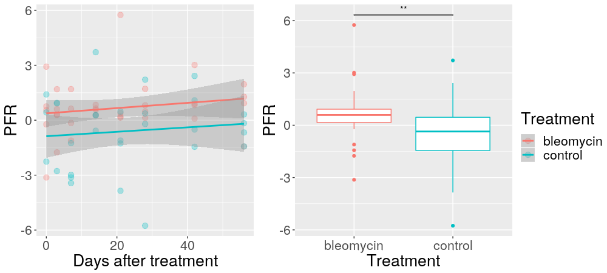

```{r setup, include=FALSE, echo=FALSE}
knitr::opts_chunk$set(echo = FALSE, warning = FALSE, message = FALSE,
       fig.path = "Development_files/figure-docx/")
```


# IPF animal models at the genomic level

  The bleomycin-induced IPF animal model is widely used to understand lung fibrosis pathology, regardless of its limited capability of mimicking the actual human disease [@Moeller2008]. Bauer and colleagues studied this question when comparing microarray data from one hundred lung samples from IPF patients with rat lungs sampled several time points after bleomycin exposure [@Bauer2015]. Although they were able to identify disease-relevant translational gene markers, the point of highest rat-human gene expression commonality was at day 7 after rat lung aggression. The authors suggest that these gene signatures can be used to identify IPF patients and to stratify these according to disease severity. Here, we reanalyze their data in order to further understand time course patterns in gene expression and their relation with cellular pathological activity.
  
  Using the arrayQualityMetrics R package, we were able to identify five outliers based on overall expression data and these were removed from further analysis - although the original paper indicated 17 outliers [@Bauer2015]. As morphological and cytometric analyses indicate that bleomycin model shows time-related pathological events [@Venosa2016; @Izbicki2002], we cut the original data into 5 supposedly divergent phases: namely, "Healthy" for untreated samples, "Injury" for rats killed at early exposure time points (3 and 7 days), "Early Fibrosis" (day 14), "Late Fibrosis" (days 21 through 28), and "Healing" (days 42 through 56). This generally arbitrary classification successfully showed descriptive gene expression patterns in principal component analysis - Figure 4. 
  

  
  Despite the low proportion of total variance explained, the first three components separate control and bleomycin samples. Most importantly, the samples at early time points - _i.e._ when the recent aggression induces major inflammatory responses - fall well separated from later times as well as from control samples. Notably, the injury-labeled samples fall further beyond others, followed by early fibrosis, late fibrosis, and finally healing-labeled and control samples - almost mimicking the actual time course experimental design and suggesting the impact of measurement times on IPF animal model assessment. Even though the authors indicate that day 7 (injury phase) is the point with maacross time must not be neglected, especially regarding assessment of IPF candidates and early-diagnosis procedures. 
  
  Once disease is installed, one may expect reproducible gene expression patterns, even though this understanding is hindered by the idiopathic characteristic of the condition. However, those patients with developing histopathological characteristics that are yet to be diagnosed as typical IPF may not reflect such genomic patterns. Furthermore, it has been reported that gene signatures differ significantly across IPF patients with progressive and stable conditions [@Boon2009]. Thus, it is important to note the importance of longituginal studies regarding genomic signatures as these may prove themelves helpful when predicting disease onset, progression, and stabilization.

  Regarding macrophage biology, several approaches are possible to assess their dynamics in animal models. As previously noted, Venosa and colleagues were able to describe macrophage activity in an animal model of IPF induced by nitrogen mustard [@Venosa2016]. Using data from cytometric, qRT-PCR, and other nonmolecular assays, the authors demonstrated the inflammatory profile of infiltrating cells at early time points, while anti-inflammatory and healing profiles where dominant at later times. The proposed kynetics related well with gene expression patterns, although high-throughput technologies were not used. 
  
  Here, the first macrophage characterizaition addresses the M1 versus M2 paradigm. As proposed by Buscher and colleagues, the Polarization Factor Ratio (PFR) is intended to describe the degree of macrophage polarization towards M1 or M2 spectra [@Buscher2017]. As a simple model, it derives from the expression levels of the M1- and M2-markers, IL-12b and Arg-1. Using Bauer's data, two-way mixed design anova with multilevel modeling did not reveal any time-dependent differencies between bleomycin- and PBS- treated (p > 0.05). However, it did reveal significant differences across treatment groups (p < 0.005), which was further confirmed by t-student (p < 0.01) and Exact Wilcoxon-Mann-Whitney tests (p < 0.01). One must note that the time courses from both groups fail to show enough divergence - likely due to noisy data points, although the courves do not overlap completely - Figure 5. Taken together, these data indicate that PFR reflects a slight overall macrophage polarization towards an M1 spectrum in such pulmonary fibrosis animal model. As a two-gene model, however, such a conclusion is clearly an oversimplification of macrophage and IPF biology 
  
  
  
