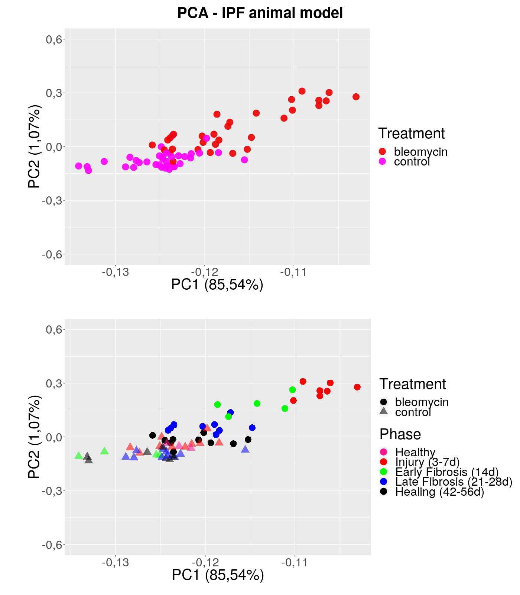
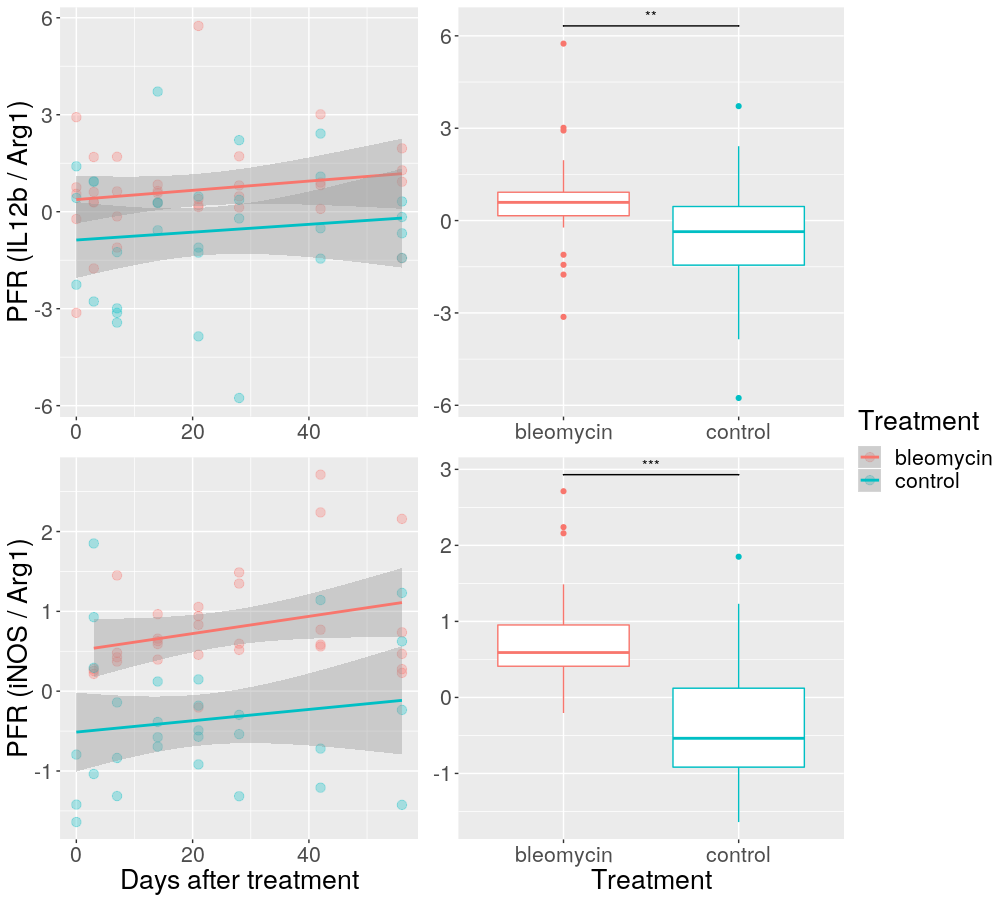
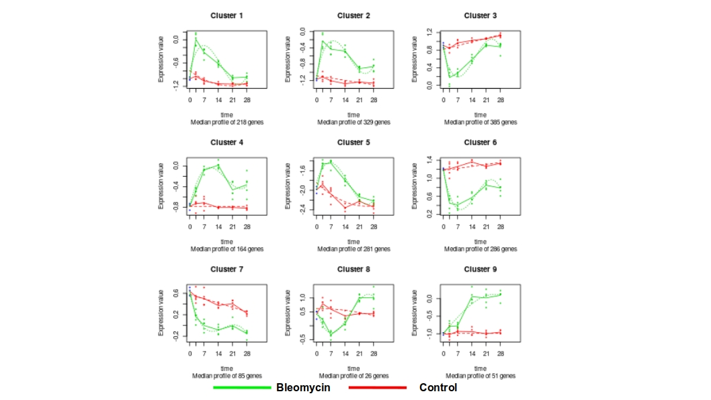
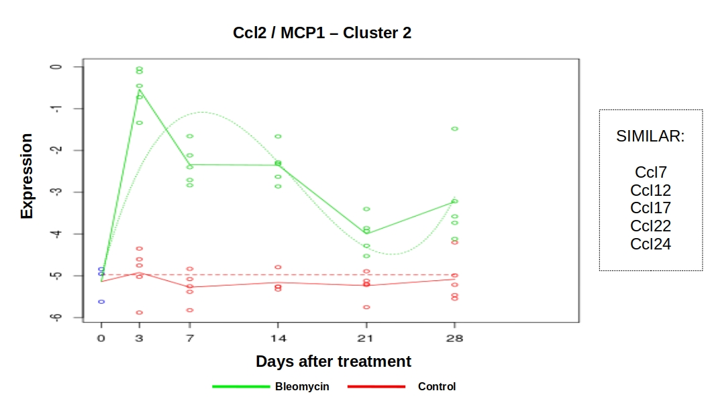
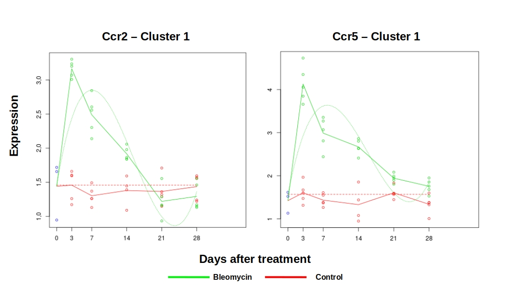
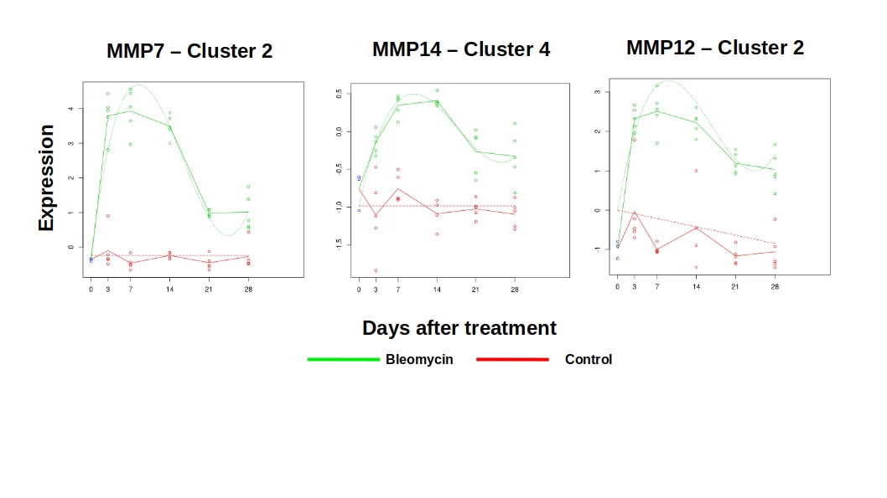
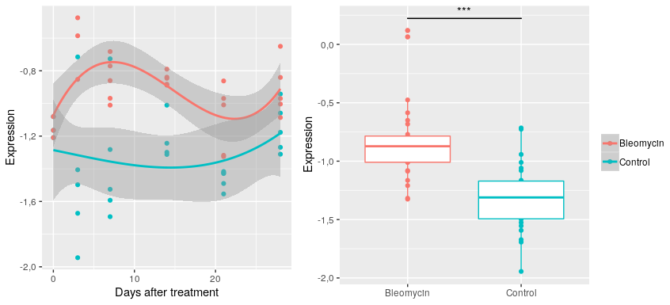
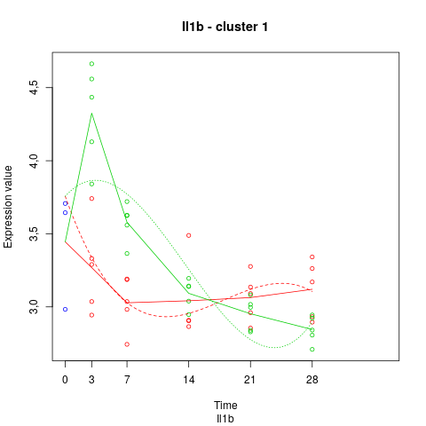
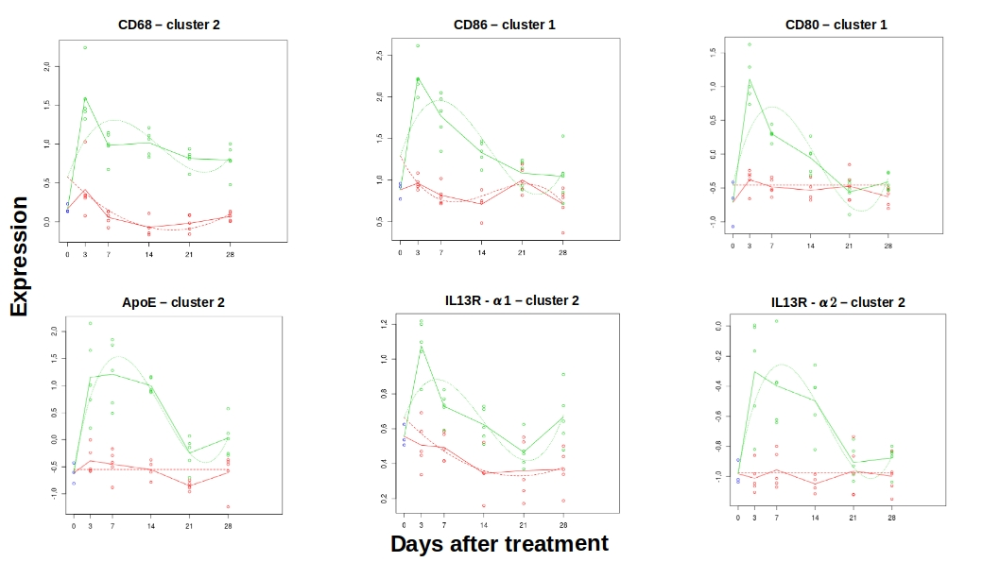

# IPF animal models at the genomic level

  The bleomycin-induced IPF animal model is widely used to understand lung fibrosis pathology, regardless of its limited capability of mimicking the actual human disease [@Moeller2008]. Bauer and colleagues studied this question when comparing microarray data from one hundred lung samples from IPF patients with rat lungs sampled several time points after bleomycin exposure [@Bauer2015]. Although they were able to identify disease-relevant translational gene markers, the point of highest rat-human gene expression commonality was at day 7 after rat lung aggression. The authors suggest that these gene signatures can be used to identify IPF patients and to stratify these according to disease severity. Here, we reanalyze their data in order to further understand time course patterns in gene expression and their relation with cellular pathological activity.
  
  Using the arrayQualityMetrics R package, we were able to identify five outliers based on overall expression data and these were removed from further analysis - although the original paper indicated 17 outliers [@Bauer2015]. As morphological and cytometric analyses indicate that bleomycin model shows time-related pathological events [@Venosa2016; @Izbicki2002], we cut the original data into 5 supposedly divergent phases: namely, "Healthy" for untreated samples, "Injury" for rats killed at early exposure time points (3 and 7 days), "Early Fibrosis" (day 14), "Late Fibrosis" (days 21 through 28), and "Healing" (days 42 through 56). This generally arbitrary classification successfully showed descriptive gene expression patterns in principal component analysis - Figure 4. 
  

  
  The first three principal components separate control and bleomycin samples. Most importantly, the samples at early time points - _i.e._ when the recent aggression induces major inflammatory responses - fall well separated from later times as well as from control samples. Notably, the injury-labeled samples fall further beyond others, followed by early fibrosis, late fibrosis, and finally healing-labeled and control samples - almost mimicking the actual time course experimental design and suggesting the impact of measurement times on IPF animal model assessment. Even though the authors indicate that day 7 (injury phase) is the point with maximum similarity among animal model and the actual human lung disease, the variance observed here may not be neglected, especially regarding assessment of IPF candidates and early-diagnosis procedures. 
  
  Once disease is installed, one may expect reproducible gene expression patterns, even though this understanding is hindered by the idiopathic characteristic of the condition. However, those patients with developing histopathological characteristics that are yet to be diagnosed as typical IPF may not reflect such genomic patterns. Furthermore, it has been reported that gene signatures differ significantly across IPF patients with progressive and stable conditions [@Boon2009]. Thus, it is important to note the importance of longitudinal studies regarding genomic signatures as these may prove themselves helpful when predicting disease onset, progression, and stabilization.

  Regarding macrophage biology, several approaches are possible to assess their dynamics in animal models. As previously noted, Venosa and colleagues were able to describe macrophage activity in an animal model of IPF induced by nitrogen mustard [@Venosa2016]. Using data from cytometric, qRT-PCR, and other non-molecular assays, the authors demonstrated the inflammatory profile of infiltrating cells at early time points, while anti-inflammatory and healing profiles where dominant at later times. The proposed kinetics related well with gene expression patterns, although high-throughput technologies were not used.
  
## Macrophage polarization in IPF animal model
  
  Here, the first macrophage characterization addresses the M1 versus M2 paradigm. As proposed by Buscher and colleagues, the Polarization Factor Ratio (PFR) is intended to describe the degree of macrophage polarization towards M1 or M2 spectra [@Buscher2017]. As a simple model, it derives from the expression levels of M1- and M2-markers. Using Bauer's data, two-way mixed design anova with multilevel modeling did not reveal any time-dependent patterns (p > 0.05). However, it did reveal significant differences across treatment groups (p < 0.005), which was further confirmed by t-student (p < 0.01) and Exact Wilcoxon-Mann-Whitney tests (p < 0.01). Figure 5 shows that time courses for both groups fail to trend any direction significantly - perhaps due to noisy data points. However, the curves do not overlap completely, and the boxplots illustrate the distribution differences. In the original paper, Buscher and colleagues demonstrated higher prediction power for the PFR built over IL12b and Arginase 1 expression levels - when comparing to the same score constructed with inducible nitric oxide synthase (iNOS - NOS2 gene, also M1-related) instead of the cited interleukin. Here, the effect size comparison seemed to be shifted, and the PFR (iNOS/Arg1) showed better separation between bleomycin- and PBS-treated animals. Taken together, these data initially indicate that PFR is capable to reflect a slight overall macrophage polarization towards an M1 spectrum in the given pulmonary fibrosis animal model. As a two-gene model, however, such a conclusion is clearly an oversimplification of macrophage and IPF biology.
  
  
  
  In order to further characterize the time-course differences in overall gene expression of bleomycin- and PBS-treated rats, we performed differential expression analysis on Bauer's data using a two-step statistical method which is especially designed for time course data and is implemented in the Bioconductor package, maSigPro [@Conesa2006]. First, the procedure fits a global model for all genes in a given dataset. Then, it applies step-wise regression as a means of variable selection so that it can detect significant differences across study groups and consistent expression profiles across time points. Although the dataset tested contained eight time points for each group, here we relied on a cubic regression model, Higher polynomial degrees have yielded high noisy fitting and possibly high rates of type I error (data not shown), which is somehow expected when working with overly complex polynomials [@Conesa2006]. One could argue the use of splines, but these are not available in the maSigPro package. To avoid underfitting, the time points 42 and 56 were excluded from this analysis. A 5% FDR cutoff was used to identify genes with significant differential expression between groups.
  
  MaSigPro also conducts cluster analysis with several strategies to identify similar expression profiles across time. Using the algorithm from mclust R package (Normal Mixture Modeling for Model-Based Clustering, Classification, and Density Estimation - available on CRAN), it can group the time courses into an optimal k number of clusters based on finite normal mixture modeling [@Scrucca2016]. However, hierarchical clustering showed similar results (with k = 9) and these were taken for further analysis. Figure 6 shows the nine clusters produced by maSigPro and their time course profiles. The dashed lines represent the fitted models, while solid lines show the true median expression values (higher resolution file available in  [https://github.com/giulianonetto/tcc/tree/master/rmd-files/Development_files/figure-docx/hclust_bauer2015_better.png](https://github.com/giulianonetto/tcc/tree/master/rmd-files/Development_files/figure-docx/hclust_bauer2015_better.png). 
  
  
  
  
  Notably, there are fairly similar clusters ( _e.g._ clusters 6 and 7). Here, however, we are particularly interested in those which show overexpression either at early or later time points, as these may be representative of eventual macrophage polarization patterns. For instance, one may speculate cluster 1 to be filled with genes related to the M1 spectrum, while cluster 4 seems to follow a transitory course and, finally, cluster 9 may represent an M2-polarized environment. Clearly, these are limited speculations once overall expression patterns greatly overlook macrophage dynamics. Therefore, deeper characterization required assessment of gene profiles on a case-by-case basis.
  
## Overall gene expression and immune-related pathways
  
  Based on recent literature, we sought to find genes that have been previously reported as related to immune cells activity and IPF. Figure 7 shows the expression for chemokine (C-C motif) ligand 2 (CCL2), also known as Monocyte chemoattractant protein 1 (MCP1), whose time course profile is representative of a selected set of other significantly differentiated chemokines that were also gathered into cluster 2. 
  
  
  
  Many chemokines have been related to fibrotic processes in general [@Sahin2013]. Specifically, CCL2/MCP1 contributes to fibrosis development as chemoattractant to monocytes, macrophages, epithelial cells, and fibroblasts - a role that interacts with other cytokines such ass TGFb-1, IL4 and IL13 [@DellaLatta2015]. In fact, CCL2 directly induces fibroblasts to express TGFb-1, which mediates collagen production. Pirfenidone, a medication currently indicated for IPF treatment (see Introduction), has been shown to inhibit the release of both CCL2 and CCL12, which helps to lower fibrotic process [@Inomata2014]. Not surprisingly, the latter chemokine also showed expression profile compatible with cluster 2 (Figure 7) as its involvement in lung fibrosis has been well established [@Moore2006]. CXCL12, which stands for C-X-C motif chemokine 12, has similar functional properties, although its expression values were somewhat noisier and appeared within cluster 4 - which shows higher increase at slightly later time points (data not shown). Finally, CCL7, CCL22, and CCL24 also clustered into the second group, are all associated with increased fibrosis and are thought as potential targets for immunotherapy development [@Yogo2009; @Sahin2013; @Amubieya2016; @Gieseck2017; @Lee2018;].
  
  Chemokines ligands act through interaction with chemokine C-C/C-X-C motif receptors, and the expression of these latter molecules is also correlated with IPF [@Sahin2013]. Interestingly, the expression of CCR5 was grouped into cluster 1, showing high levels at very early time points - this held true for two probes mapping to the same gene, a common finding in microarray data. This protein has shown reportedly reduction behavior in bleomycin animal models and IPF patients, altough has been suggested that its depletion has anti-fibrotic effects [@Ishida2007]. Another chemokine receptor, CCR2, is associated with CCL2 activity, although it does interact with other chemoattractant agents, including CCL7, CCL8, and CCL13 [@Sahin2013]. It is present in monocytes, T helper lymphocytes, and dendritic cells. As CCR2 deficient mice have been reported as protected against lung fibrosis through multiple mechanisms (rather than immune cell trafficking solely), the CCL2-CCR2 axis revealed itself as a potential pharmacological target. Expression profiles of CCR2 and CCR5 are illustrated in Figure 8.
  
  
  
  Not long ago, clinical investigation was carried out to assess the efficacy of carlumab, an anti-CCL2 antibody [@Raghu2015a]. The evident failure of the treatment suggested that modulating chemokine pathways may turn out much more complex than expected. Recently, Milger and colleagues addressed this unfortunate surprise by measuring CCR2 expression levels on subtypes of immune cells [@Milger2017]. Previous work from their research group revealed that children with interstitial lung disease showed increased CCL2 release as well as CCR2+ CD4+ T-cell frequencies, and these findings were correlated with disease severity and lung function [@Hartl2005]. The confounding scenario led the authors to wonder about the "multi-faceted role of CCR2+ cells in lung injury" [@Milger2017]. In the updated work, they found major immunosupressive roles played by CCR2+ CD4+ T cells, which were associated with T regulatory cells. Using adoptive cell assays, they were able to attenuate lung inflammation and fibrotic process development. This is specially surprising as CCR2/CCL2 signals have been extensively associated with pro-inflammatory activity - mainly related to innate immune system. They conclude that depleting such CCR2-depending pathways can no longer be addressed while not considering their heterogeneous functional properties throughout immune cellular system - a claim that might hold true for other related molecules.
  
  Another set of molecules particularly investigated in IPF is the group of metalloproteinases [@Dancer2011]. A wide range of these enzymes has been reported as overexpressed in IPF patients and animal models [@Pardo2016]. Potential peripheral blood biomarkers for IPF include MMP1 and MMP7 [@Rosas2018]. Their plasma concentrations were able to distinguish IPF from patients with chronic obstructive pulmonary disease, sarcoidosis, and chronic/subacute hypersensitivity pneumonitis - reaching sensivity and specificity values as high as 96.3% and 87.2%, respectively. MMP7 also predicted well subclinical interstitial lung disease, reduced forced vital capacity and carbon monoxide diffusing capacity. On the other hand, not all studies with bronchoalveolar lavage fluid studies have accused increased MMP1 levels, although microarray data on whole lung tissue does support increase detection [@Dancer2011]. Bauer and colleagues, the authors of the study whose data we have been analyzing so far, did find upregulation of MMP7 gene, but not MMP1 [@Bauer2015]. Similar results were generated by maSigPro algorithm herein reported, and the gene fell into cluster 1 - Figure 9. Still, while the former is known as a pro-fibrotic agent, the latter represents a paradox that is yet to be solved. Capable of cleaving fibrillar collagens, MMP1 is associated with excessive extracellular matrix degradation - which is opposed to IPF pathogenesis [@Pardo2016]. Although partial explanations involve its production location, usually separated from fibroblasts and collagen accumulation, the roles of MMP1 are far from being fully explained. Overexpression of MMP12, another pro-fibrotic agent, is also a common finding in IPF animal models [@Pardo2016]. Here, it was found to be significantly overexpressed across time, being associated to cluster 2 from maSigPro analysis - Figure 9. More time-consistent, however, was the time course profile of MMP14 (cluster 4), whose role in IPF is presently unknown - note its expression increase takes longer than genes in cluster 2. Both enzymes were also identified by Bauer's analysis with similar time trends. 
  
  
  
  As in the case of chemokines, metalloproteinases have been proven as a complex set of opportunities for pharmaceutical and biomarkers development. Augmenting expression MMP13 and MMP19, two anti-fibrotic enzymes, seems to have therapeutic potential [@Craig2015]. Inhibiting pro-fibrotic MMPs is also intended. While global inhibition may not be beneficial, monoclonal antibody engineering is an approach under active research [@Sela-Passwell2012; @Craig2015]. The enzymes, though, represent only a fraction of the complexity involved in IPF pathogenesis.
  
  Major cytokines associated with IPF include IL12, IL33, IL1b1, TGFb1, IL4, IL13, IL25, and so on [@Gieseck2017]. The highly complex interaction networks formed by these multiple-origin and multiple-targeted molecules has been extensively addressed, and the current understanding is that wound-healing and pro-fibrotic mechanisms are still to be scrutinized. As illustrated by the CCL2/CCR2 case, these molecular patterns are thought to be highly context dependent, and so the cellular dynamics behind their expression and biological activities builds a major and multifaceted challenge towards pulmonary fibrosis understanding. In this sense, it is important step back and acknowledge that a hallmark of dysregulated fibrogenesis is the excessive deposition of extracellular matrix (ECM). Fibroblasts are prominent players in ECM deposition as they hyperproliferate within damaged tissue, become resistant to apoptosis, and differentiate into pro-fibrotic myofibroblasts - which perpetuates the fibrotic process [@Kolahian2016]. While in this inflammation-driven activated status, these cells show hypersensitive responses to a wide range of chemical signals, including many of the above cited molecules, but also to leukotrienes, prostaglandins, and growth factors [@Kendall2014]. Moreover, myofibroblasts can also produce, for instance, IL1b, TGFb1, IL33 and other allarmins, several chemokines, and even reactive oxygen species. Finally, fibroblast-mediated remodeling of extracellular space greatly contributes to the trafficking of immune cells. In fact, fibroblasts work alongside epithelial/endothelial cells and perivascular macrophages to regulate alveolar repair and fibrosis [@Kolahian2016]. It is within this complex scenario that we address cytokine production. Although cell population frequencies can be inferred from gene expression studies, one must keep in mind the multiple sources and targets of immune-related chemicals. 
  
  TGFb1 has been classically associated with fibrotic processes, and many other fibrosis-related cytokines are thought to work through its signaling pathways [@Fernandez2012]. It is centrally active in epithelial-mesenchymal transition (EMT), a process through which epithelial cells assume mesenchymal properties, acquire capacity migrate and to differentiate into ECM-producing fibroblasts [@Kolahian2016; @Kalluri2009]. Inflammatory cytokines, such as IL1b1, TNFa, and IFNg, have modulatory effects over TGFb1 production, comprising a network that involves monocytes, macrophages, epithelial cells. Its gene expression profile has been demonstrated both in IPF patients and animal models [@Luzina2015]. Interestingly, using our third-degree polynomial regression model, TGFb1 overexpression over time could not be detected. As in the case of PFR, however, Exact Wilcoxon-Mann-Whitney test revealed global differences between bleomycin- and PBS-treated rats - Figure 10. Of note, Bauer and colleagues detected differential expression for this gene at day 3 after bleomycin exposure [@Bauer2015].
  
  
  
  
  Note that we have been using maSigPro plotting functions for cases were the generated regression curves produced statistical significance. In this particular case, however, we use the versatile, CRAN-available [ggplot2](http://ggplot2.org) package, which is an implementation of "The Grammar of Graphs" [@Wickham2015].
  
  Another important cytokine in the context of IPF is IL1b1 [@Luzina201]. As well as TGFb1, the molecule is produced by and it acts on fibroblasts [@Kendall2014]. Major amounts are also produced by macrophages [@Wynn2010]. In fact, this cytokine is able to reproduce many features of bleomycin-induced pulmonary fibrosis, and the blockade of its signals through monoclonal antibody administration has reduced mice fibrotic development [@Byrne2016]. As a classical inflammation biomarker, IL1b1 was detected through polynomial regression and placed into cluster 1. Nonetheless, Bauer and colleagues did not reported differential expression for this gene. As shown in Figure 11, the levels of this cytokine were indeed uncommonly increased in two of samples from day 0, and all the control data looks somewhat noisy. Still, pairwise comparisons using Wilcoxon rank sum test revealed significant differences at days 3 and 7 after treatment (p < 0.01). Overall, this is a good example of why microarray experiments are often validated with qRT-PCR assays, and even of how different statistical and bioinformatics procedures can impact results. Another confusing case includes the detected underexpression of IL33 (cluster 6), which goes against recent literature reports [@Li2014; @Kolahian2016]. Additionally, overexpression at late time points of its receptor gene, Interleukin 1 receptor-like 1 (IL1RL1), was detected in cluster 9 - and also reported by Bauer and colleagues (days 14 and 21).
  
  
  
  Finally, other noteworthy immune-related genes that were found to be differentially expressed in Bauer's data include the  costimulatory molecules CD80 and CD86, which are prominent in the functionality of antigen-presenting cells (APCs) such as macrophages [@Collins2005]; the macrophage surface marker, CD68, a scavenger receptor [@Venosa2016]; the macrophage-modulating, anti-inflammatory apolipoprotein E (ApoE) [@Baitsch2012; @Yao2016]; and the IL-13 receptor subunits alpha-1 and alpha-2 (IL13R-a1/a2). Note that both subunits were overexpressed in Bauer's data, contradicting recent reports for subunit alpha-1 in murine models and IPF patients [@Karo-Atar2016]. Additionally, protective roles have been suggested for both IL13R-a1 and IL13R-a2 in the context of pulmonary fibrosis [@Lumsden2015; @Karo-Atar2016]. The expression profiles of the cited molecules are illustrated in Figure 12.
  

  
  
  
# Macrophage Polarization Factor Ratio reviewed - a modular perspective

  In the last decade, traditional immunology research was faced with innovative systems biology approaches in the work of Chaussabel and colleagues [@Chaussabel2008]. As noted by Ena Wang and Francesco M. Marincola (2008) in the Immunity Previews of July 18, 2008:
  
  "In summary, Chaussabel et al. (2008) suggest an inductive approach to pathway discovery: Disease-specific gene-expression patterns are identified and condensed into few functional units; these are presumed to represent down-stream effects of biological mechanisms determining the disease status (...). This evidence-based analysis represents a paradigm shift in which system biology (immunology) is approached from the bedside, yielding information most likely to be relevant to human suffering and confronting the basic immunologist and cell biologist with the challenge of aligning experimental observations with the reality of human disease approached in its uncontrollable complexity. Moreover, the modular approach offers practical applications as a global-biomarker-discovery tool that will need to be aggressively validated in the future." [@Wang2008]

  This was the very first introduction to the approach used by Xue and colleagues, over 6 years later, to describe the transcriptome patterns from almost 300 human macrophages through single-cell RNA sequencing technology [@Xue2014]. In fact, although the PFR performed well in the recent work form Buscher and colleagues, a 2-gene model is clearly an oversimplification of macrophage biology and hence probably not the best method for describing disease pathological status. In the original paper, the authors actually employed their PFR to select gene signatures from LPS-stimulated murine macrophages and these were ultimately used to assess human disease [@Buscher2017]. Using Bauer's IPF animal model data, we identified global differences in "raw" PFR between bleomycin-treated and control rats, even though IL12, arginase 1 and iNOS were not detected as differentially expressed. Now, we employ these new perspectives of immunology to define a _modular Polarization Factor Ratio_ (mPFR), which is based on Xue modules and the clusters derived from longitudinal assessment of Bauer's data. We tested several configurations for mPFR and selected those with higher performance in classifying patients in several conditions - healthy, IPF, IPF stable, IPF progressive. Generally, the mPFR candidates are generated by taking the quotient between the median expression values - $Med$ - from sets of genes associated with M1 and M2 spectra in sample $i$, and correcting by overall expression levels across $n$ samples. The equation 1 shows the general formula, which is based on PFR calculation from [@Buscher2017].
  
  $$\frac{Med (GeneSet 1_{i})}{Med (GeneSet 2_{i})} * \frac{Med (Med (GeneSet 2)_1^n)}{Med (Med (GeneSet 1)_1^n)}$$

  
  
  

